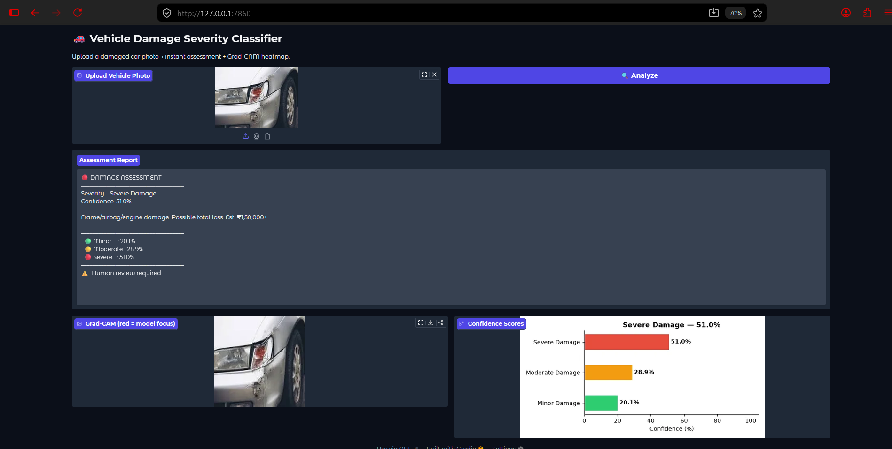
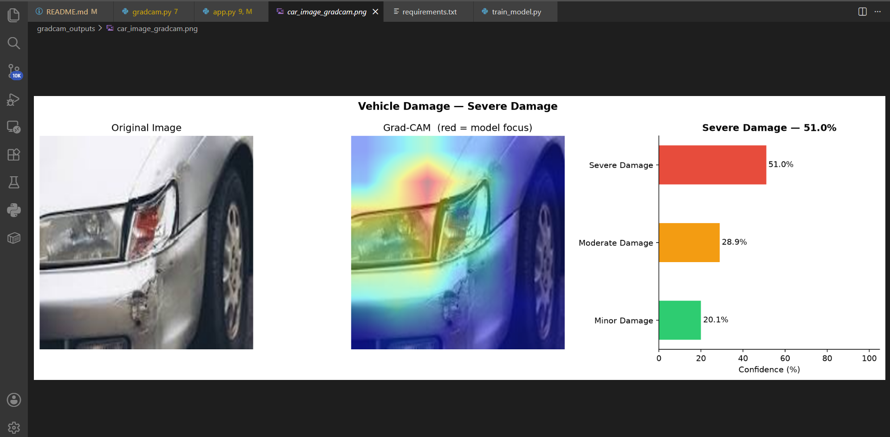
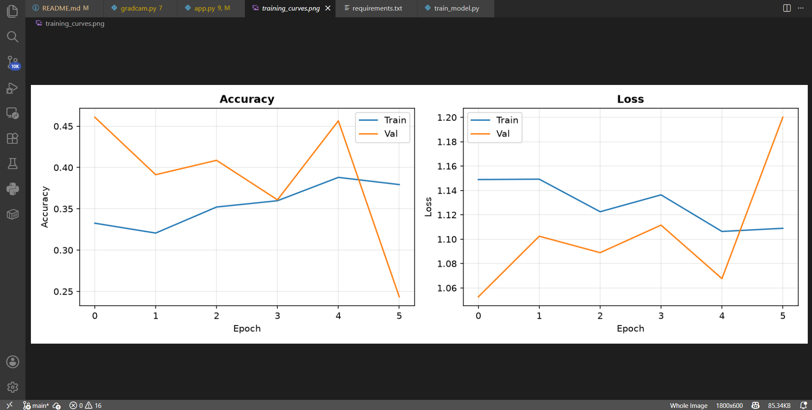

# Vehicle Damage Severity Classifier

An end-to-end computer vision project that classifies vehicle damage severity
from photos using Transfer Learning (MobileNetV2), explains predictions using
Grad-CAM heatmaps, and delivers results through a web interface built for
insurance claims workflows.

---

## What This Project Does

> Given a photo of a damaged vehicle, classify damage as Minor / Moderate /
> Severe, highlight which region of the car drove the prediction, and present
> results in a format an insurance adjuster can act on.

| Stage | Technique | Output |
|---|---|---|
| Feature extraction | MobileNetV2 pretrained on ImageNet | 1280-dim feature vector |
| Classification | Fine-tuned dense head | Minor / Moderate / Severe + probabilities |
| Explainability | Grad-CAM on last conv layer | Heatmap showing which damage region matters |
| Interface | Gradio web app | Upload photo → instant assessment |

---

## Why PyTorch

This project was built in PyTorch instead of TensorFlow for three reasons:

**1. Industry standard for research and production.**
PyTorch is the framework used by Meta, Tesla, and most top AI research labs.
The majority of recent papers (transformers, diffusion models, LLMs) release
PyTorch code first. Knowing PyTorch is more transferable than TensorFlow for
mid-to-senior level roles.

**2. Python version compatibility.**
TensorFlow does not support Python 3.12+ as of 2025. PyTorch supports all
modern Python versions including 3.11, 3.12, and 3.13 with pre-built wheels —
no C compiler or build tools needed.

**3. More control and transparency.**
PyTorch's dynamic computation graph means you write standard Python — no
sessions, no graph compilation, no Keras abstraction layer. The training loop,
Grad-CAM hooks, and data loading are all plain Python code you can read and
debug line by line. This makes it easier to explain every part in an interview.

---

## Project Structure

vehicle_damage/
├── train_model.py     # MobileNetV2 transfer learning training pipeline
├── gradcam.py         # Grad-CAM explainability heatmap generator
├── app.py             # Gradio web interface
├── requirements.txt   # Python dependencies
├── README.md          # This file
└── data/              # Dataset (not committed to git)
├── train/
│   ├── minor/
│   ├── moderate/
│   └── severe/
└── val/
├── minor/
├── moderate/
└── severe/

---

---

## Dataset Setup

Download the Car Damage Detection dataset from Kaggle:
https://www.kaggle.com/datasets/anujms/car-damage-detection

Extract and organise images into the folder structure above.
The dataset's `00-damage` folder maps to your damage classes.
Split 80% into train and 20% into val for each class.

Dataset used in this project:
- train/minor: 320 images
- train/moderate: 300 images
- train/severe: 300 images
- val/minor: 110 images
- val/moderate: 30 images
- val/severe: 30 images

---

## How to Run

### 1. Create a Python 3.11 virtual environment

PyTorch requires Python 3.11 or lower for full compatibility.

```powershell
C:\Users\Admin\AppData\Local\Programs\Python\Python311\python.exe -m venv .venv311
.venv311\Scripts\Activate.ps1
```

### 2. Install dependencies

```powershell
pip install -r requirements.txt
```
(if necessary, upgrade gradio version 4.7.1 -> 4.44.1)

```powershell  
pip install gradio --upgrade
```

### 3. Train the model

```powershell
python train_model.py
```

This will:
- Validate your dataset structure and print image counts
- Download MobileNetV2 pretrained weights from PyTorch Hub
- Train for up to 20 epochs with early stopping
- Save the best model as `vehicle_damage_model.pth`
- Save training curves as `training_curves.png`

Training takes 10-30 minutes on CPU.

### 4. Generate Grad-CAM explanation for an image

```powershell
python gradcam.py car_photo.jpg
```

Output saved to `gradcam_outputs/` folder.

### 5. Launch the web interface

```powershell
python app.py
```

Open browser at `http://127.0.0.1:7860`

---

## Key Technical Decisions

**Why MobileNetV2?**
Lightweight CNN with inverted residual blocks. Fast inference, strong accuracy,
and standard in production visual inspection systems. Pre-trained on 1.2M
ImageNet images — those features transfer well to car damage detection.

**Why Transfer Learning?**
A car damage dataset has hundreds of images, not millions. Training from scratch
would overfit severely. Freezing ImageNet weights and fine-tuning only the top
layers gives much better results with limited data.

**Why Grad-CAM?**
Insurance is a regulated industry. You cannot tell a claims officer "the AI
said severe." You need to point to exactly which damaged panel drove the
verdict. Grad-CAM generates a spatial heatmap showing model focus regions —
red means high influence, blue means low influence.

**Why Gradio?**
A model sitting in a terminal has zero business value. Gradio turns it into a
usable browser interface in 20 lines of Python — no HTML, no JavaScript, no
deployment complexity needed.

---

## Requirements

torch
torchvision
numpy
matplotlib
pillow
gradio

---

## Screenshots

### Gradio Web Interface


### Grad-CAM Heatmap Explanation


### Training Curves

